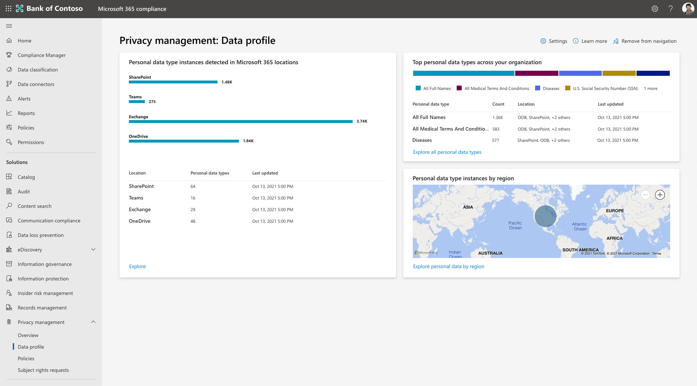

# Encontrar e visualizar dados pessoais no Microsoft Priva

O Microsoft Priva ajuda você a entender os dados que sua organização armazena automatizando a descoberta de ativos de dados pessoais e fornecendo visualizações de informações essenciais. Essas visualizações podem ser encontradas na visão **geral** e nas páginas **de perfil de** dados. Você pode agir sobre as informações aqui para fortalecer a postura de privacidade da sua organização e reduzir o risco.

Para começar, vá para a seção Priva [do Centro de conformidade do Microsoft 365 e](https://compliance.microsoft.com/) veja estas páginas:

- **Visão** geral: fornece uma visão geral dos dados da sua organização em Microsoft 365. Os administradores de privacidade podem monitorar tendências e atividades, identificar e investigar possíveis riscos envolvendo dados pessoais e springboard em atividades importantes, como gerenciamento de políticas ou ações de solicitação de direitos de assunto.
- **Perfil de** dados: fornece um instantâneo dos dados pessoais que sua organização armazena em Microsoft 365. Esta página ajuda você a visualizar onde os dados pessoais residem, quais tipos são os mais prevalentes em sua organização e quantos tipos diferentes existem em locais em seu ambiente Microsoft 365 ambiente. Você também pode explorar dados pessoais deste local.

À medida que seus dados mudam e Priva faz novas descobertas, as informações mostradas nessas páginas serão atualizadas. Observe que pode levar até 24 horas para que novos dados sejam representados nos gráficos.

## Explorar a página de visão geral

A página de visão geral consiste em três seções principais. Os blocos na parte superior da página fornecem estatísticas recentes essenciais sobre seus dados. A seção insights principais fornece oportunidades de investigação em tendências e áreas de interesse fundamental. Para mais perspectivas sobre seu ambiente de dados, consulte os gráficos de linha de tendência. Para saber mais sobre essas áreas, consulte as seções abaixo.

### Blocos principais

#### As combinações de política nos últimos 7 dias

Quando as políticas são definidas em Priva Privacy Risk Management, seus dados serão avaliados com base em suas políticas para determinadas condições que podem apresentar riscos de privacidade. As combinações de política indicam descobertas de dados que podem precisar de revisão ou correção. Este tile mostra quantas partidas de política ocorreram nos últimos sete dias. As combinações serão a tona aqui se as políticas estão ou estão em execução no modo de teste, para que você possa ver os resultados de todas as suas políticas ativas. Selecionar esse tile levará você a uma exibição filtrada da página  Políticas de Gerenciamento de Risco de Privacidade, mostrando as políticas que tiveram uma combinação ocorrer nos últimos sete dias.

#### Itens com dados pessoais

Para ver os recursos de descoberta automatizadas de Priva no trabalho, revise **o item Items with personal data** tile. Este item mostra quantos novos itens que contêm dados pessoais com base em suas configurações foram descobertos no ambiente de Microsoft 365 da sua organização nos últimos sete dias. Selecionar esse item carregará uma exibição dos 100 itens mais novos descobertos.

#### Solicitações de direitos de assunto

A página de visão geral inclui um azulejo que mostra quantas solicitações de direitos de assunto foram criadas nos últimos sete dias. Um segundo tile, se aplicável, mostra quantas solicitações estão atrasadas com base em seus prazos designados e pode precisar de atenção imediata. Selecionar esses blocos levará os usuários com as permissões apropriadas para a página de solicitação de direitos de assunto de Priva.

### Principais percepções

#### Itens de conteúdo com os dados mais pessoais

O conteúdo que contém uma grande quantidade de dados pessoais pode apresentar um risco maior de exposição. Você pode querer revisar esses itens para garantir que eles sejam cobertos por uma política de Gerenciamento de Riscos de Privacidade. Para ajudar a chamar a atenção desses itens, a página visão geral fornece uma exibição em seus itens de conteúdo que contêm os dados mais pessoais de acordo com suas configurações. Aqui você pode ver o número de tipos de dados pessoais exclusivos detectados, quantos proprietários de conteúdo exclusivos foram identificados e quantos titulares de dados foram identificados de acordo com as configurações de correspondência de dados para solicitações de direitos de assunto.

Selecione **Exibir resumo** para uma exibição de resumo dos itens encontrados. Você também pode optar por **Explorar essas** descobertas para visualizar arquivos individuais. Esta exibição mostra um máximo de 100 itens. Os usuários no grupo de função Gerenciamento de Privacidade podem selecionar arquivos para revisar detalhes e determinar a relevância e exportar a lista no formato .csv para referência.

#### Políticas com mais combinações na última semana

Esse insight mostra quais políticas foram mais frequentes nos últimos sete dias, seja no modo "On" ou "Testing". Ele ajuda a ilustrar o desempenho de suas políticas e os efeitos do trabalho contínuo à medida que seus usuários Priva refinam seus comportamentos de privacidade.

Selecione **Exibir resumo** para um resumo das 10 principais políticas que corresponderam e os proprietários de conteúdo do conteúdo associado. Você também verá quantas notificações de usuário foram enviadas devido a essas combinações de política e o número de ações do usuário realizadas. Selecione **Investigar** para exibir a página Políticas no Gerenciamento de Riscos de Privacidade, filtrada para mostrar as políticas do ponto de vista de resumo. Essa exibição investigativa mostrará estatísticas para o tempo de vida completo da política. Selecione-o para ver detalhes, como quando itens matched foram detectados inicialmente.

#### Usuários com a política mais igualada na última semana

Esse insight também aborda as combinações de políticas no modo "Testing" ou "On". Ele permite que você veja um resumo dos usuários com mais combinações de política na última semana e quais políticas eles coincidem. Isso inclui totais dos proprietários de conteúdo exclusivos, notificações enviadas a esses usuários e quantas ações foram tomadas dessas notificações. Selecionar **Investigar** leva você para a página políticas, filtrada para mostrar as políticas do exibição de resumo. No ponto de vista investigativo, você não encontrará informações do usuário, mas poderá selecionar uma política para ver detalhes de política relacionados a essas partidas.

#### Itens com mais conteúdo de assunto de dados

Esse insight faz referência a informações do recurso de correspondência de dados em solicitações de direitos de assunto e superfície itens de conteúdo descobertos em Microsoft 365 que contêm a maioria dos titulares de dados. Para saber mais sobre essa configuração, consulte [Learn about Subject Rights Requests](subject-rights-requests.md).

Esses itens podem ajudar a confirmar a configuração de correspondência de dados e a reduzir os riscos de privacidade relacionados a esses itens. Selecione **Exibir resumo** para um exibição de resumo. Selecione **Explorar** para uma exibição detalhada de até 100 desses itens. Aqui você pode visualizar esses itens e determinar a relevância e exportar a lista .csv formato.

### Gráficos de linha de tendência

Para visualizações dinâmicas das tendências encontradas nos dados da sua organização, consulte os gráficos de linha de tendência. Esses gráficos podem ser filtrados por características como intervalos de tempo, tipo de dados ou locais de dados. Use os menus suspensos fornecidos para ajustar seu exibição. Passar o mouse sobre linhas no gráfico permitirá que você veja estatísticas relacionadas a esse ponto específico no tempo.

Os resultados relacionados às políticas incluirão dados de políticas no modo "Testing" e "On". Se nenhuma política de um tipo específico estiver ativa, os gráficos relacionados não mostrarão resultados.

#### Alertas de política ativa

Esta área mostra um instantâneo de alertas ativos disparados por diretivas. Com o tempo, essa exibição pode ajudá-lo a detectar mais facilmente anormalidades como picos grandes em volume. Selecione **Exibir alertas para** navegar até a página políticas dentro do Gerenciamento de Riscos de Privacidade, onde você pode investigar ainda mais os alertas e criar problemas para correção.

#### Dados pessoais encontrados na organização

Este gráfico mostra as tendências de quantos dados pessoais que coincidem com suas configurações foram descobertos ao longo do tempo em seu ambiente Microsoft 365 e onde eles estão localizados. Ele começará a ser preenchido depois que Priva for executado por tempo suficiente e depois que o conteúdo com dados pessoais tiver sido encontrado em SharePoint, OneDrive, Teams e/ou Exchange.

#### Transferências de dados detectadas na organização

Este gráfico está relacionado às políticas de transferência de dados. Ele fornece uma visão de como os dados estão se movendo em sua organização, entre departamentos ou entre regiões para organizações multi-geográficas.

#### Dados pessoais nãousados

Este gráfico está relacionado às políticas de minimização de dados. Ele fornece informações sobre como sua organização está armazenar conteúdo contendo dados pessoais e como suas políticas podem melhorar a manipulação desses dados ao longo do tempo.

#### Dados pessoais sobrepostos

Este gráfico está relacionado a políticas de sobreexposure de dados. Ele pode ajudá-lo a identificar comportamentos de compartilhamento ao longo do tempo em sua organização e locais onde o conteúdo com dados pessoais pode ser sobreposto, por exemplo, sendo compartilhado publicamente, compartilhado com um usuário externo ou compartilhado amplamente em sua organização.

#### Solicitações de direitos de assunto por regulamentação

Esta exibição fornece informações sobre quais regulamentos mais predominantemente orientam as solicitações de direitos de assunto ao longo do tempo. A legenda deste gráfico mostra os nomes dos regulamentos de tendência. Passar o mouse sobre as linhas de tendência mostrará o total de solicitações de direitos de assunto abertas para essa regulamentação durante o tempo selecionado.

#### Solicitações de direitos de assunto por status

Este gráfico exibe como sua organização está fazendo com a conclusão de solicitações de direitos de assunto, divididas em solicitações que estão **ativas****, fechadas** ou **atrasadas**. As descobertas aqui podem ajudar a indicar onde você pode se beneficiar da alocação de mais recursos para fechar suas solicitações e metas de reunião.

### Exibições de dados adicionais

#### Solicitações de direitos de assunto rapidamente

Essa exibição fornece uma exibição de alto nível de solicitações de direitos de assunto ativas, incluindo o tempo restante para concluir solicitações por seus prazos. Ele resume quantas solicitações totais você tem, quantas estão ativas e quantas estão fechadas. Selecione **Exibir todas as solicitações** para ir para a página solicitação de direitos de assunto, onde você pode exibir mais detalhes e trabalhar nas solicitações ativas para progressá-las para conclusão.

#### Solicitações de direitos de assunto por residência

Essa exibição de mapa ajuda você a visualizar seu volume de solicitações de direitos de assunto pela residência dos titulares dos dados. Passar o mouse sobre uma bolha identificará a região e o total de solicitações de direitos de assunto abertas em nome dos residentes de lá.

## Explorar a página de perfil de dados

A página de perfil de dados em Priva fornece uma exibição de instantâneo dos dados pessoais que sua organização armazena Microsoft 365 e onde ele mora. Ele também fornece informações sobre os tipos de dados que você armazena. Os blocos principais incluem o seguinte.

### Instâncias de tipo de dados pessoais detectadas em Microsoft 365

Esse azulejo ajuda você a visualizar a quantos dados pessoais existem em seu ambiente Microsoft 365 com base em suas configurações e como esses dados são distribuídos entre Exchange, OneDrive, SharePoint e Teams.

O gráfico de barras mostra a contagem aproximada de instâncias de tipo de dados pessoais exclusivas encontradas em seu conteúdo. Exemplos de tipos de dados podem incluir coisas como números de cartão de crédito e números de previdência social. Portanto, um arquivo descoberto que contém três números de cartão de crédito e um número de seguro social conteria dois tipos de dados pessoais exclusivos e quatro instâncias. A parte inferior deste azulejo mostra os tipos de dados pessoais exclusivos em cada Microsoft 365 local. Ele fornece uma exibição sobre a diversidade de tipos de dados pessoais detectados no conteúdo da sua organização.

### Principais tipos de dados pessoais em toda a sua organização

Esse bloco fornece um instantâneo dos principais tipos de dados pessoais detectados em seu ambiente, juntamente com informações sobre quantos itens contêm esse tipo de dados pessoais e em quais locais.

### Instâncias de tipo de dados pessoais por região

Para ambientes multi-geo, esse azulamento agrega regionalmente instâncias de tipo de dados pessoais encontradas em seu conteúdo, com base nas regiões nas quais esse conteúdo está hospedado. Para organizações de uma única região, esse tile mostrará um ponto que representa seu Microsoft 365 local. Passar o mouse sobre os pontos no mapa mostrará a contagem aproximada de instâncias de tipo de dados pessoais descobertas nessa região.

### Explorando conteúdo

Selecionar **Explorar** em qualquer grupo de perfis de dados abrirá o explorador de conteúdo. No momento, você não pode pesquisar um item de conteúdo específico e não verá Teams dados neste exibição. Isso significa que os números no explorador de conteúdo podem não corresponder aos números mostrados na página de perfil de dados, já que a página de perfil de dados inclui Teams conteúdo. Os administradores de privacidade que querem obter mais informações sobre seus dados de privacidade podem fazer isso aqui com base no tipo de dados pessoais (tipo de informação confidenciais) ou por local (Exchange, OneDrive ou SharePoint).

## Aviso de isenção de responsabilidade legal

[Aviso de isenção de responsabilidade legal da Microsoft Priva](priva-disclaimer.md)
