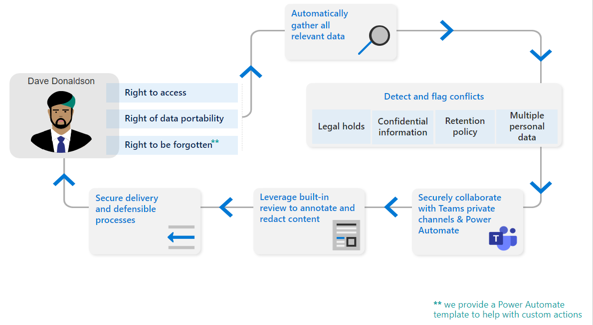

# Guia estratégico de avaliação: Microsoft Priva

Bem-vindo ao playbook de avaliação do Microsoft Priva.

Este playbook ajudará você a fazer o máximo de sua avaliação gratuita de 90 dias, ajudando você a proteger seus dados pessoais e a criar um local de trabalho resiliente à privacidade.

Usando recomendações da Microsoft, você aprenderá como Priva pode ajudá-lo a identificar e proteger proativamente contra riscos de privacidade, como a acumulação de dados, transferências de dados e o compartilhamento de dados, ajudar sua organização a automatizar e gerenciar solicitações de assunto em escala e capacitar seus funcionários a tomar decisões inteligentes de tratamento de dados.

## Introdução

*Essas ações são recomendações sobre os principais recursos para experimentar em sua avaliação de 90 dias.*

Inicie sua avaliação configurando os pré-requisitos. Observe que Priva consiste em duas soluções principais, Priva Privacy Risk Management e Priva Subject Rights Requests, que podem ser tentadas e compradas separadamente. Detalhes de licenciamento e compra podem ser encontrados no [Microsoft.com](https://www.microsoft.com/security/business/privacy/privacy-management-software?rtc=1#office-ContentAreaHeadingTemplate-8x0pmkp).

### Gerenciamento de Riscos de Privacidade

Com a **solução gerenciamento de** riscos de privacidade, você pode explorar como proteger os dados pessoais da sua organização e criar um local de trabalho resiliente à privacidade.

- Identificar e proteger proativamente contra riscos de privacidade, como a acumulação de dados, transferências de dados e o compartilhamento de dados
- Obter visibilidade sobre o armazenamento e o movimento de dados pessoais
- Capacitar os funcionários de informações a tomar decisões inteligentes sobre como lidar com esses dados
- Permitir que os usuários gerenciem efetivamente os dados e tomem medidas para atender aos regulamentos de privacidade em evolução

### Solicitações de Direitos de Assunto

Com a **solução Solicitações de Direitos de** Assunto, você pode aprender a lidar com consultas da solicitação inicial para produzir relatórios.

- Gerenciar solicitações de direitos de assunto em escala

## Iniciar sua avaliação do Microsoft Priva

Se você estiver pronto para começar a usar o Microsoft Priva, siga estas etapas para configurar os pré-requisitos e começar a explorar informações de privacidade.

1. [Confirmar assinaturas e licenciamento](priva-setup.md#step-1-confirm-subscriptions-and-licensing)
1. [Definir permissões de usuário e atribuir funções](priva-setup.md#step-3-set-user-permissions-and-assign-roles)
1. Selecione "Iniciar avaliação" e o seguinte será feito para você:
    - Licenças de avaliação priva são habilitadas (isso acontece em tempo real)
    - Insights de privacidade são gerados (isso leva 24 horas)

## Comece a localizar e visualizar riscos de privacidade

Priva ajuda você a entender os dados que sua organização armazena automatizando a descoberta de ativos de dados pessoais e fornecendo visualizações de informações essenciais.

Para começar, vá para a seção Priva [do Centro de conformidade do Microsoft 365 e](https://compliance.microsoft.com/) veja estas páginas:

1. [Visão](priva-data-profile.md#explore-the-overview-page) geral: fornece uma visão agregada de sua postura de privacidade, incluindo o volume, categoria, local e movimentação de dados pessoais em seu ambiente Microsoft 365 ambiente. Além disso, você tem visibilidade sobre o status atual e as tendências dos riscos de privacidade associados resultantes de dados pessoais serem supera compartilhadas, transferidas ou não sendousadas.
1. [Perfil de](priva-data-profile.md#explore-the-data-profile-page) dados: fornece um instantâneo dos dados pessoais que sua organização armazena em Microsoft 365, incluindo volume, tipo e local (armazenamento e geografia).

## Saiba mais sobre políticas

O Gerenciamento de Riscos de Privacidade oferece a você a capacidade de configurar políticas que identificam riscos de privacidade em seu ambiente Microsoft 365 e permitem uma correção fácil.

1. [Saiba mais sobre os principais cenários de risco](risk-management.md#learn-about-key-risk-scenarios)
1. [Limitar a sobreexposure de dados](risk-management.md#limit-data-overexposure)
1. [Encontrar e reduzir transferências de dados](risk-management.md#find-and-mitigate-data-transfers)
1. [Minimizar dados armazenados](risk-management.md#minimize-stored-data)

## Criar e personalizar políticas

Crie novas políticas no Gerenciamento de Riscos de Privacidade para resolver cenários de risco de privacidade importantes para sua organização. Para um início rápido, use os modelos padrão para criar novas políticas para superexposure de dados, transferências de dados e minimização de dados e cenários.

1. [Criar uma política a partir de um modelo](risk-management-policies.md#create-a-policy-from-a-template)
1. [Criar uma política personalizada](risk-management-policies.md#create-a-custom-policy)
1. [Saiba mais sobre as principais configurações de todas as políticas](risk-management-policies.md#learn-about-key-settings-for-all-policies)
1. [Saiba mais sobre configurações para políticas de minimização de dados](risk-management-policies.md#learn-about-settings-for-data-minimization-policies)
1. [Saiba mais sobre configurações para políticas de transferência de dados](risk-management-policies.md#learn-about-settings-for-data-transfer-policies)
1. [Saiba mais sobre configurações para políticas de sobreexposure de dados](risk-management-policies.md#learn-about-settings-for-data-overexposure-policies)

## Gerenciar políticas

Depois de criar políticas no Gerenciamento de Riscos de Privacidade para lidar com cenários de minimização de dados, transferência de dados ou sobreexposuração de dados, talvez você queira revisar ou atualizar suas configurações de política. Você também pode querer testar uma nova política antes de a lançar totalmente para uso contínuo.

1. [Exibir detalhes da política](risk-management-policies-manage.md#view-policy-details)
1. [Testar sua política](risk-management-policies-manage.md#test-your-policy)
1. [Excluir uma política](risk-management-policies-manage.md#delete-a-policy)

## Entender os alertas e os problemas da política

A revisão de alertas permite identificar casos que precisam de acompanhamento. Você pode fazer isso criando problemas, que dão aos seus usuários uma maneira estruturada de revisar conteúdo, atribuir a gravidade do problema e trabalhar colaborativamente para resolver problemas.

1. [Exibir alertas e problemas atuais](risk-management-alerts.md#view-current-alerts-and-issues)
1. [Gerenciar alertas](risk-management-alerts.md#manage-alerts)
1. [Gerenciar problemas](risk-management-alerts.md#manage-issues)
1. [Revisar conteúdo e resolver problemas](risk-management-alerts.md#review-content-and-remediate-issues)

## Enviar notificações de política de usuários

O Gerenciamento de Riscos de Privacidade pode notificar os proprietários de conteúdo diretamente sobre as suas políticas de sobreexposure de dados, minimização de dados e transferência de dados. Com as notificações por email, seus usuários podem facilmente descobrir sobre o conteúdo que precisam revisar.

1. [Preparar conteúdo de treinamento para notificações de política](risk-management-notifications.md#prepare-training-content-for-policy-notifications)
1. [Configurar notificações de email para políticas](risk-management-notifications.md#set-up-email-notifications-for-policies)
1. [Correção de problemas de notificações por email](risk-management-notifications.md#remediate-issues-from-email-notifications)
1. [Enviar notificações em Teams](risk-management-notifications.md#send-notifications-in-teams)

## Saiba mais sobre Solicitações de Direitos de Assunto

De acordo com determinados regulamentos de privacidade em todo o mundo, indivíduos (ou titulares de dados) podem fazer solicitações para revisar ou gerenciar os dados pessoais sobre si mesmos coletados pelas empresas. Esses pedidos são às vezes também chamados de Solicitações do titular dos dados (DSRs), Solicitações de acesso ao titular dos dados (DSARs), ou Solicitações de direitos do consumidor. Priva Subject Rights Requests pode ajudá-lo a lidar com essas perguntas.

1. [Criar solicitações e coletar dados](subject-rights-requests-create.md)
1. [Correspondência de dados](subject-rights-requests-data-match.md)
1. [Revisar dados e colaborar em solicitações](subject-rights-requests-data-review.md)
1. [Atender solicitações](subject-rights-requests-reports.md)
1. [Automatizar tarefas](subject-rights-requests-automate.md)

## Criar solicitações de direitos de entidade

Os administradores de gerenciamento de direitos de assunto podem abrir novas solicitações de direitos de assunto por meio da página principal Solicitações de Direitos de Assunto. Um assistente o orientará durante o processo de encontrar dados pessoais sobre um titular de dados e iniciar o processo de atendimento de sua solicitação.

1. [Use o assistente de solicitação de direitos de assunto](subject-rights-requests-create.md#use-the-subject-rights-request-creation-wizard) – crie uma solicitação
1. [Definir configurações de pesquisa](subject-rights-requests-create.md#define-search-settings)
1. [Refinar configurações de pesquisa](subject-rights-requests-create.md#refine-your-search)

## Gerenciar a correspondência de dados para solicitações de direitos de assunto

Com a correspondência de dados, as organizações podem permitir que Priva identifique titulares de dados com base nos valores de dados fornecidos exatos.

1. [Preparar para importação de dados](subject-rights-requests-data-match.md#prepare-for-data-import)
1. [Definir o esquema de dados pessoais](subject-rights-requests-data-match.md#define-the-personal-data-schema)
1. [Upload dados pessoais](subject-rights-requests-data-match.md#upload-personal-data)

## Examinar dados e colaborar em solicitações de direitos de entidade

Depois de criar uma solicitação de direitos de assunto, Priva usará suas entradas sobre seu assunto para procurar por combinações no ambiente de Microsoft 365 da sua organização. Depois que esses dados são compilados, você pode revisar as descobertas, fazer escolhas sobre o que incluir e rediscar informações conforme necessário.

1. [Revisar detalhes da solicitação e monitorar o andamento](subject-rights-requests-data-review.md#step-1-review-request-details-and-monitor-progress)
1. [Exibir e editar consultas de pesquisa](subject-rights-requests-data-review.md#step-2-optional-view-and-edit-search-queries)  (opcional)
1. [Revisar dados](subject-rights-requests-data-review.md#step-3-review-data)
1. [Fechar a solicitação](subject-rights-requests-data-review.md#step-4-close-the-request)

## Gerenciar relatórios de solicitações de direitos de entidade e atender solicitações

Depois de concluir sua revisão de dados para uma solicitação de direitos de assunto, você pode seguir em frente para solicitar o atendimento.

1. [Preparar relatórios finais para o assunto de dados](subject-rights-requests-reports.md#prepare-final-reports-for-the-data-subject)
1. [Integrar com soluções de parceiros](subject-rights-requests-reports.md#integrate-with-partner-solutions)
1. [Gerenciar retenção de dados](subject-rights-requests-reports.md#manage-data-retention)

## Automatizar tarefas de solicitações de direitos de entidade

Habilita Power Automate fluxos para Priva automatizar tarefas importantes para casos e usuários, como criar tíquetes no ServiceNow ou adicionar lembretes de calendário sobre datas de vencimento.

1. [Criar um novo fluxo Power Automate de um modelo](subject-rights-requests-automate.md#create-a-new-power-automate-flow-from-a-template)
1. [Compartilhar um Power Automate fluxo](subject-rights-requests-automate.md#share-a-power-automate-flow)
1. [Editar ou excluir Power Automate fluxo](subject-rights-requests-automate.md#edit-or-delete-power-automate-flow)

## Recursos adicionais

**Microsoft Docs**: obter informações detalhadas sobre como o Microsoft Priva funciona e como implementá-lo melhor para sua organização. [Visite Docs](priva-overview.md).

**Por que o Microsoft Priva**: saiba mais sobre os recursos Priva neste [vídeo](https://www.youtube.com/watch?v=6OLky1biPIQ).

**Saiba mais sobre o Microsoft Priva**: blogs, planos, preços [aqui](https://aka.ms/privacymgmt/web).

**Comprar Microsoft Priva**: Gerenciamento de Riscos de Privacidade e Solicitações de Direitos de Assunto são vendidas separadamente. Detalhes de licenciamento e compra podem ser encontrados no [Microsoft.com](https://www.microsoft.com/en-us/security/business/privacy/privacy-management-software?rtc=1#office-ContentAreaHeadingTemplate-8x0pmkp).
